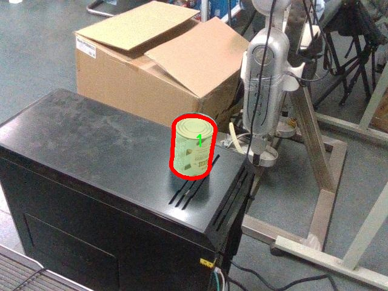

# 饮品类型识别分割系统源码＆数据集分享
 [yolov8-seg-C2f-SCcConv＆yolov8-seg-aux等50+全套改进创新点发刊_一键训练教程_Web前端展示]

### 1.研究背景与意义

项目参考[ILSVRC ImageNet Large Scale Visual Recognition Challenge](https://gitee.com/YOLOv8_YOLOv11_Segmentation_Studio/projects)

项目来源[AAAI Global Al lnnovation Contest](https://kdocs.cn/l/cszuIiCKVNis)

研究背景与意义

随着社会经济的快速发展和人们生活水平的不断提高，饮品市场呈现出多样化和个性化的趋势。消费者对饮品的选择不仅限于传统的饮料，越来越多的新型饮品如健康饮品、功能饮品等逐渐进入市场，满足了不同消费者的需求。在这种背景下，饮品的种类繁多，如何高效、准确地识别和分类不同类型的饮品成为了一个亟待解决的问题。传统的饮品识别方法往往依赖于人工分类，不仅效率低下，而且容易受到人为因素的影响，导致识别结果的不准确。因此，基于计算机视觉技术的自动化饮品识别系统应运而生。

YOLO（You Only Look Once）系列模型作为一种先进的目标检测算法，因其高效性和准确性在计算机视觉领域得到了广泛应用。YOLOv8作为该系列的最新版本，进一步提升了检测精度和速度，适用于实时性要求较高的应用场景。然而，针对饮品类型的识别，YOLOv8的标准模型仍存在一定的局限性，尤其是在复杂背景下的分割能力和对细小目标的识别精度。因此，改进YOLOv8以适应饮品类型识别的需求，将是提升饮品识别系统性能的关键。

本研究将基于改进的YOLOv8模型，构建一个饮品类型识别分割系统。为此，我们将使用包含3800张图像的sqh_dataset数据集，该数据集涵盖了14种不同类别的饮品，包括白草味、白特、甘情、经典、咖啡、科研师、乐视、年轻、雀巢、舒华、旺仔、杨梅、叶子和伊利等。这些类别的多样性为模型的训练提供了丰富的样本，有助于提高模型的泛化能力和识别准确率。

本研究的意义不仅在于提升饮品类型的识别精度，更在于推动计算机视觉技术在饮品行业的应用。通过构建高效的饮品识别系统，可以为饮品生产企业提供智能化的产品分类与管理方案，帮助企业更好地了解市场需求，优化产品结构。同时，该系统还可以为消费者提供更为便捷的饮品选择体验，提升消费者的满意度。

此外，饮品类型识别分割系统的研究也为其他领域的目标检测与分割提供了借鉴。通过改进YOLOv8模型的研究，我们可以探索其在其他复杂场景下的应用潜力，推动计算机视觉技术的进一步发展。因此，本研究不仅具有理论价值，也具备广泛的应用前景，为饮品行业的智能化转型提供了重要的技术支持。

### 2.图片演示


##### 注意：由于此博客编辑较早，上面“2.图片演示”和“3.视频演示”展示的系统图片或者视频可能为老版本，新版本在老版本的基础上升级如下：（实际效果以升级的新版本为准）

  （1）适配了YOLOV8的“目标检测”模型和“实例分割”模型，通过加载相应的权重（.pt）文件即可自适应加载模型。

  （2）支持“图片识别”、“视频识别”、“摄像头实时识别”三种识别模式。

  （3）支持“图片识别”、“视频识别”、“摄像头实时识别”三种识别结果保存导出，解决手动导出（容易卡顿出现爆内存）存在的问题，识别完自动保存结果并导出到tempDir中。

  （4）支持Web前端系统中的标题、背景图等自定义修改，后面提供修改教程。

  另外本项目提供训练的数据集和训练教程,暂不提供权重文件（best.pt）,需要您按照教程进行训练后实现图片演示和Web前端界面演示的效果。

### 3.视频演示

[3.1 视频演示](https://www.bilibili.com/video/BV1Yd2WY1ELs/)

### 4.数据集信息展示

##### 4.1 本项目数据集详细数据（类别数＆类别名）

nc: 16
names: ['1', '10', '11', '12', '13', '14', '15', '16', '2', '3', '4', '5', '6', '7', '8', '9']


##### 4.2 本项目数据集信息介绍

数据集信息展示

在本研究中，我们使用了名为“sqh_dataset”的数据集，以训练和改进YOLOv8-seg模型，旨在实现高效的饮品类型识别与分割。该数据集专门设计用于处理多种饮品的图像数据，涵盖了丰富的类别信息，使得模型能够在复杂的场景中进行准确的分类和分割。

“sqh_dataset”包含16个独特的饮品类别，分别为‘1’至‘16’。这些类别代表了不同类型的饮品，可能包括各种果汁、碳酸饮料、茶饮、咖啡等。每个类别的选择都经过精心考虑，以确保涵盖市场上常见的饮品类型，进而提升模型的实用性和适应性。通过对这些类别的深入学习，YOLOv8-seg能够识别和分割出图像中各类饮品的轮廓和特征，从而为后续的应用提供强有力的支持。

数据集的构建过程包括了多样化的图像采集，确保了不同光照、角度和背景下的饮品图像均被纳入训练集。这种多样性不仅增强了模型的鲁棒性，还提高了其在实际应用中的表现。每个类别的图像数量经过精心设计，以保证模型在训练过程中能够充分学习到每个类别的特征，同时避免过拟合现象的发生。

在数据集的标注过程中，采用了精确的分割技术，以确保每个饮品的边界清晰可辨。这种高质量的标注为YOLOv8-seg的训练提供了可靠的基础，使得模型能够在分割任务中表现出色。标注过程中还考虑到了不同饮品的外观特征，如颜色、形状和包装设计等，使得模型在面对真实世界中的复杂场景时，能够准确地进行识别和分割。

此外，数据集还包含了多种背景和环境设置，以模拟实际应用中可能遇到的各种情况。这种背景多样性使得模型能够适应不同的拍摄条件，从而提高其在真实环境中的应用能力。通过对“sqh_dataset”的充分利用，我们期望能够训练出一个不仅能够识别饮品类型，还能准确分割出饮品轮廓的高效模型。

总之，“sqh_dataset”作为本研究的核心数据来源，凭借其丰富的类别信息和高质量的图像标注，为YOLOv8-seg模型的训练提供了坚实的基础。通过对该数据集的深入分析和应用，我们相信能够推动饮品类型识别与分割技术的发展，为相关领域的研究和应用提供新的思路和解决方案。





### 5.全套项目环境部署视频教程（零基础手把手教学）

[5.1 环境部署教程链接（零基础手把手教学）](https://www.bilibili.com/video/BV1jG4Ve4E9t/?vd_source=bc9aec86d164b67a7004b996143742dc)


[5.2 安装Python虚拟环境创建和依赖库安装视频教程链接（零基础手把手教学）](https://www.bilibili.com/video/BV1nA4VeYEze/?vd_source=bc9aec86d164b67a7004b996143742dc)

### 6.手把手YOLOV8-seg训练视频教程（零基础小白有手就能学会）

[6.1 手把手YOLOV8-seg训练视频教程（零基础小白有手就能学会）](https://www.bilibili.com/video/BV1cA4VeYETe/?vd_source=bc9aec86d164b67a7004b996143742dc)


按照上面的训练视频教程链接加载项目提供的数据集，运行train.py即可开始训练



     Epoch   gpu_mem       box       obj       cls    labels  img_size
     1/200     0G   0.01576   0.01955  0.007536        22      1280: 100%|██████████| 849/849 [14:42<00:00,  1.04s/it]
               Class     Images     Labels          P          R     mAP@.5 mAP@.5:.95: 100%|██████████| 213/213 [01:14<00:00,  2.87it/s]
                 all       3395      17314      0.994      0.957      0.0957      0.0843

     Epoch   gpu_mem       box       obj       cls    labels  img_size
     2/200     0G   0.01578   0.01923  0.007006        22      1280: 100%|██████████| 849/849 [14:44<00:00,  1.04s/it]
               Class     Images     Labels          P          R     mAP@.5 mAP@.5:.95: 100%|██████████| 213/213 [01:12<00:00,  2.95it/s]
                 all       3395      17314      0.996      0.956      0.0957      0.0845

     Epoch   gpu_mem       box       obj       cls    labels  img_size
     3/200     0G   0.01561    0.0191  0.006895        27      1280: 100%|██████████| 849/849 [10:56<00:00,  1.29it/s]
               Class     Images     Labels          P          R     mAP@.5 mAP@.5:.95: 100%|███████   | 187/213 [00:52<00:00,  4.04it/s]
                 all       3395      17314      0.996      0.957      0.0957      0.0845


### 7.50+种全套YOLOV8-seg创新点代码加载调参视频教程（一键加载写好的改进模型的配置文件）

[7.1 50+种全套YOLOV8-seg创新点代码加载调参视频教程（一键加载写好的改进模型的配置文件）](https://www.bilibili.com/video/BV1Hw4VePEXv/?vd_source=bc9aec86d164b67a7004b996143742dc)

### 8.YOLOV8-seg图像分割算法原理

原始YOLOv8-seg算法原理

YOLOv8-seg算法是2023年由Ultralytics公司推出的YOLO系列目标检测算法的最新版本，它在YOLOv7的基础上进行了多项创新和优化，特别是在目标检测和图像分割任务的结合上，展现出强大的性能和灵活性。YOLOv8-seg不仅延续了YOLO系列一贯的高效性和实时性，还通过引入更深的卷积神经网络结构和多种先进技术，进一步提升了目标检测的精度和速度。

首先，YOLOv8-seg算法的核心在于其独特的网络结构设计。整个模型分为三个主要部分：Backbone、Neck和Head。Backbone部分负责特征提取，采用了一系列卷积和反卷积层，这些层通过残差连接和瓶颈结构的组合，显著减小了网络的复杂度，同时提高了特征提取的能力。YOLOv8-seg在Backbone中引入了C2模块，这种模块通过多层次的特征学习，能够有效捕捉图像中的重要信息，为后续的目标检测和分割提供了坚实的基础。

在Neck部分，YOLOv8-seg利用多尺度特征融合技术，将来自Backbone不同阶段的特征图进行有效的融合。这一过程不仅增强了模型对不同尺度目标的感知能力，还提高了目标检测的鲁棒性。通过这种特征融合，YOLOv8-seg能够更好地处理复杂场景中的目标，确保在各种环境下都能保持高效的检测性能。

Head部分则是YOLOv8-seg的关键所在，它负责最终的目标检测和分割任务。与以往的YOLO版本不同，YOLOv8-seg采用了解耦头的设计，将目标分类和边界框回归任务分开处理。这种解耦的方式使得每个任务能够更加专注于自身的目标，从而有效解决了在复杂场景下可能出现的定位不准和分类错误的问题。此外，YOLOv8-seg引入了Anchor-free的目标检测方法，避免了传统方法中对锚点框的依赖。这一创新使得模型在预测目标位置时更加灵活，能够直接回归目标的边界框，减少了对锚点框选择和调整的繁琐过程。

YOLOv8-seg的另一个显著特点是其在图像分割方面的能力。通过将目标检测与分割任务结合，YOLOv8-seg能够实现对目标的精确定位和轮廓提取。这一功能在许多实际应用中都具有重要意义，例如在智能监控、自动驾驶和医学影像分析等领域，YOLOv8-seg能够提供更为全面和细致的目标识别与分析。

在训练过程中，YOLOv8-seg采用了多尺度训练和测试策略，这一策略不仅提高了模型的泛化能力，还使得模型在面对不同大小和形状的目标时，能够保持良好的检测性能。通过在多种数据集上进行训练，YOLOv8-seg能够适应各种复杂的场景，确保在实际应用中具备高效的实时检测能力。

值得一提的是，YOLOv8-seg在模型的轻量化方面也进行了深入的研究和优化。相较于之前的YOLO版本，YOLOv8-seg的权重文件进一步减小，使得该模型能够在各种嵌入式设备上高效运行。这一特性使得YOLOv8-seg在实时检测和边缘计算场景中展现出更大的应用潜力。

综上所述，YOLOv8-seg算法通过深度卷积神经网络结构、特征融合技术、解耦头设计以及Anchor-free方法的引入，显著提升了目标检测和图像分割的性能。其在多种实际应用场景中的广泛适用性，使得YOLOv8-seg成为当前目标检测领域的重要工具，能够为各种智能应用提供高效、准确的解决方案。随着YOLOv8-seg的不断发展和完善，未来在目标检测和图像分割领域的应用前景将更加广阔。


### 9.系统功能展示（检测对象为举例，实际内容以本项目数据集为准）

图9.1.系统支持检测结果表格显示

  图9.2.系统支持置信度和IOU阈值手动调节

  图9.3.系统支持自定义加载权重文件best.pt(需要你通过步骤5中训练获得)

  图9.4.系统支持摄像头实时识别

  图9.5.系统支持图片识别

  图9.6.系统支持视频识别

  图9.7.系统支持识别结果文件自动保存

  图9.8.系统支持Excel导出检测结果数据


### 10.50+种全套YOLOV8-seg创新点原理讲解（非科班也可以轻松写刊发刊，V11版本正在科研待更新）

#### 10.1 由于篇幅限制，每个创新点的具体原理讲解就不一一展开，具体见下列网址中的创新点对应子项目的技术原理博客网址【Blog】：


[10.1 50+种全套YOLOV8-seg创新点原理讲解链接](https://gitee.com/qunmasj/good)

#### 10.2 部分改进模块原理讲解(完整的改进原理见上图和技术博客链接)【此小节的图要是加载失败请移步原始博客查看，链接：https://blog.csdn.net/cheng2333333?type=blog】

### YOLOv8简介


由上图可以看出，C2中每个BottlNeck的输入Tensor的通道数channel都只是上一级的0.5倍，因此计算量明显降低。从另一方面讲，梯度流的增加，t也能够明显提升收敛速度和收敛效果。
C2i模块首先以输入tensor(n.c.h.w)经过Conv1层进行split拆分，分成两部分(n,0.5c,h,w)，一部分直接经过n个Bottlenck，另一部分经过每一操作层后都会以(n.0.5c,h,w)的尺寸进行Shortcut，最后通过Conv2层卷积输出。也就是对应n+2的Shortcut(第一层Conv1的分支tensor和split后的tensor为2+n个bottenlenneck)。
#### Neck
YOLOv8的Neck采用了PANet结构，如下图所示。

Backbone最后SPPF模块(Layer9)之后H、W经过32倍下采样，对应地Layer4经过8倍下采样，Layer6经过16倍下采样。输入图片分辨率为640*640，得到Layer4、Layer6、Layer9的分辨率分别为80*80、40*40和20*20。
Layer4、Layer6、Layer9作为PANet结构的输入，经过上采样，通道融合，最终将PANet的三个输出分支送入到Detect head中进行Loss的计算或结果解算。
与FPN(单向，自上而下)不同的是，PANet是一个双向通路网络，引入了自下向上的路径，使得底层信息更容易传递到顶层。
#### Head
Head部分相比Yolov5改动较大，直接将耦合头改为类似Yolo的解耦头结构(Decoupled-Head)，将回归分支和预测分支分离，并针对回归分支使用了Distribution Focal Loss策略中提出的积分形式表示法。之前的目标检测网络将回归坐标作为一个确定性单值进行预测，DFL将坐标转变成一个分布。


### LSKNet的架构
该博客提出的结构层级依次为：

LSK module（大核卷积序列+空间选择机制） < LSK Block （LK Selection + FFN）<LSKNet（N个LSK Block）


#### LSK 模块

LSK Block
LSKNet 是主干网络中的一个可重复堆叠的块（Block），每个LSK Block包括两个残差子块，即大核选择子块（Large Kernel Selection，LK Selection）和前馈网络子块（Feed-forward Network ，FFN），如图8。LK Selection子块根据需要动态地调整网络的感受野，FFN子块用于通道混合和特征细化，由一个全连接层、一个深度卷积、一个 GELU 激活和第二个全连接层组成。

LSK module（LSK 模块，图4）由一个大核卷积序列（large kernel convolutions）和一个空间核选择机制（spatial kernel selection mechanism）组成，被嵌入到了LSK Block 的 LK Selection子块中。

#### Large Kernel Convolutions
因为不同类型的目标对背景信息的需求不同，这就需要模型能够自适应选择不同大小的背景范围。因此，作者通过解耦出一系列具有大卷积核、且不断扩张的Depth-wise 卷积，构建了一个更大感受野的网络。

具体地，假设序列中第i个Depth-wise 卷积核的大小为 ，扩张率为 d，感受野为 ，它们满足以下关系：


卷积核大小和扩张率的增加保证了感受野能够快速增大。此外，我们设置了扩张率的上限，以保证扩张卷积不会引入特征图之间的差距。


Table2的卷积核大小可根据公式（1）和（2）计算，详见下图：


这样设计的好处有两点。首先，能够产生具有多种不同大小感受野的特征，便于后续的核选择；第二，序列解耦比简单的使用一个大型卷积核效果更好。如上图表2所示，解耦操作相对于标准的大型卷积核，有效地将低了模型的参数量。

为了从输入数据  的不同区域获取丰富的背景信息特征，可采用一系列解耦的、不用感受野的Depth-wise 卷积核：


其中，是卷积核为 、扩张率为  的Depth-wise 卷积操作。假设有个解耦的卷积核，每个卷积操作后又要经过一个的卷积层进行空间特征向量的通道融合。


之后，针对不同的目标，可基于获取的多尺度特征，通过下文中的选择机制动态选择合适的卷积核大小。

这一段的意思可以简单理解为：

把一个大的卷积核拆成了几个小的卷积核，比如一个大小为5，扩张率为1的卷积核加上一个大小为7，扩张率为3的卷积核，感受野为23，与一个大小为23，扩张率为1的卷积核的感受野是一样的。因此可用两个小的卷积核替代一个大的卷积核，同理一个大小为29的卷积核也可以用三个小的卷积代替（Table 2），这样可以有效的减少参数，且更灵活。

将输入数据依次通过这些小的卷积核（公式3），并在每个小的卷积核后面接上一个1×1的卷积进行通道融合（公式4）。

#### Spatial Kernel Selection
为了使模型更关注目标在空间上的重点背景信息，作者使用空间选择机制从不同尺度的大卷积核中对特征图进行空间选择。

首先，将来自于不同感受野卷积核的特征进行concate拼接，然后，应用通道级的平均池化和最大池化提取空间关系，其中， 和  是平均池化和最大池化后的空间特征描述符。为了实现不同空间描述符的信息交互，作者利用卷积层将空间池化特征进行拼接，将2个通道的池化特征转换为N个空间注意力特征图，之后，将Sigmoid激活函数应用到每一个空间注意力特征图，可获得每个解耦的大卷积核所对应的独立的空间选择掩膜，又然后，将解耦后的大卷积核序列的特征与对应的空间选择掩膜进行加权处理，并通过卷积层进行融合获得注意力特征 ，最后LSK module的输出可通过输入特征  与注意力特征  的逐元素点成获得，公式对应于结构图上的操作如下：


### 11.项目核心源码讲解（再也不用担心看不懂代码逻辑）

#### 11.1 ultralytics\utils\plotting.py

以下是对给定代码的核心部分进行分析和详细注释的结果。代码主要涉及颜色处理、图像注释、绘图等功能，以下是经过简化和注释的核心部分：

```python
import numpy as np
import cv2
from PIL import Image, ImageDraw, ImageFont

class Colors:
    """
    颜色类，用于管理和转换颜色。
    """
    def __init__(self):
        # 定义颜色调色板
        hexs = ('FF3838', 'FF9D97', 'FF701F', 'FFB21D', 'CFD231', '48F90A', 
                '92CC17', '3DDB86', '1A9334', '00D4BB', '2C99A8', '00C2FF', 
                '344593', '6473FF', '0018EC', '8438FF', '520085', 'CB38FF', 
                'FF95C8', 'FF37C7')
        self.palette = [self.hex2rgb(f'#{c}') for c in hexs]  # 将十六进制颜色转换为RGB
        self.n = len(self.palette)  # 颜色数量

    @staticmethod
    def hex2rgb(h):
        """将十六进制颜色转换为RGB元组。"""
        return tuple(int(h[i:i + 2], 16) for i in (1, 3, 5))  # 提取RGB值

colors = Colors()  # 创建颜色实例

class Annotator:
    """
    图像注释类，用于在图像上绘制边框、文本和关键点。
    """
    def __init__(self, im, line_width=None, font_size=None, font='Arial.ttf', pil=False):
        self.im = im if isinstance(im, Image.Image) else Image.fromarray(im)  # 将输入图像转换为PIL格式
        self.draw = ImageDraw.Draw(self.im)  # 创建绘图对象
        self.lw = line_width or 2  # 默认线宽
        # 尝试加载字体
        try:
            self.font = ImageFont.truetype(font, font_size or 12)
        except Exception:
            self.font = ImageFont.load_default()  # 加载默认字体

    def box_label(self, box, label='', color=(128, 128, 128), txt_color=(255, 255, 255)):
        """在图像上绘制带标签的边框。"""
        self.draw.rectangle(box, outline=color, width=self.lw)  # 绘制边框
        if label:
            w, h = self.font.getsize(label)  # 获取文本尺寸
            self.draw.rectangle((box[0], box[1] - h, box[0] + w, box[1]), fill=color)  # 绘制标签背景
            self.draw.text((box[0], box[1] - h), label, fill=txt_color, font=self.font)  # 绘制标签文本

    def result(self):
        """返回注释后的图像。"""
        return np.asarray(self.im)  # 将PIL图像转换为numpy数组

def save_one_box(xyxy, im, file='im.jpg', gain=1.02, pad=10, square=False):
    """
    根据边界框保存图像裁剪。
    """
    b = ops.xyxy2xywh(xyxy.view(-1, 4))  # 将xyxy格式转换为xywh格式
    if square:
        b[:, 2:] = b[:, 2:].max(1)[0].unsqueeze(1)  # 将矩形框转换为正方形
    b[:, 2:] = b[:, 2:] * gain + pad  # 增加框的大小
    xyxy = ops.xywh2xyxy(b).long()  # 转换回xyxy格式
    crop = im[int(xyxy[0, 1]):int(xyxy[0, 3]), int(xyxy[0, 0]):int(xyxy[0, 2])]  # 裁剪图像
    Image.fromarray(crop).save(file)  # 保存裁剪后的图像
    return crop  # 返回裁剪后的图像

def plot_images(images, batch_idx, cls, bboxes=np.zeros(0, dtype=np.float32), fname='images.jpg'):
    """绘制带标签的图像网格。"""
    mosaic = np.full((640, 640, 3), 255, dtype=np.uint8)  # 创建白色背景的图像
    for i, im in enumerate(images):
        x, y = (i % 4) * 160, (i // 4) * 160  # 计算图像在网格中的位置
        mosaic[y:y + 160, x:x + 160] = im  # 将图像放入网格
    cv2.imwrite(fname, mosaic)  # 保存网格图像
```

### 代码核心部分说明：
1. **Colors类**：用于管理颜色调色板，提供从十六进制颜色到RGB颜色的转换。
2. **Annotator类**：用于在图像上绘制边框、文本和关键点。可以通过`box_label`方法在图像上添加带标签的矩形框。
3. **save_one_box函数**：根据给定的边界框裁剪图像并保存，支持调整裁剪框的大小和形状。
4. **plot_images函数**：将多个图像绘制成一个网格并保存。

这些核心部分构成了图像处理和可视化的基础，适用于目标检测和其他计算机视觉任务。

这个文件 `ultralytics/utils/plotting.py` 是一个用于可视化的工具类，主要用于与 Ultralytics YOLO 模型相关的图像处理和绘图功能。该文件包含多个类和函数，帮助用户在训练和推理过程中进行数据可视化。

首先，文件导入了一些必要的库，包括 `cv2`、`matplotlib`、`numpy`、`torch` 和 `PIL`，这些库提供了图像处理和绘图的基础功能。此外，还导入了一些自定义的工具和设置，如 `LOGGER`、`TryExcept`、`ops` 和 `plt_settings`。

文件中定义了一个 `Colors` 类，用于管理颜色调色板。该类包含了一个初始化方法，定义了一组颜色，并提供了将十六进制颜色代码转换为 RGB 值的方法。通过这个类，用户可以方便地获取预定义的颜色，用于绘制边框、文本等。

接下来是 `Annotator` 类，它是一个图像注释工具，能够在图像上绘制矩形框、文本、关键点和掩码等。该类的构造函数接受图像、线宽、字体等参数，并根据用户的需求选择使用 PIL 或 OpenCV 进行绘制。`Annotator` 类中包含多个方法，例如 `box_label` 用于绘制带标签的矩形框，`masks` 用于在图像上绘制掩码，`kpts` 用于绘制关键点等。

此外，文件还定义了一些绘图函数，如 `plot_labels`、`save_one_box`、`plot_images`、`plot_results`、`plt_color_scatter` 和 `plot_tune_results`。这些函数提供了绘制标签、保存图像裁剪、绘制图像网格、绘制训练结果、绘制散点图和绘制超参数调优结果的功能。每个函数都有详细的参数说明和示例，便于用户理解和使用。

最后，文件还包含一些辅助函数，如 `output_to_target` 和 `feature_visualization`，用于将模型输出转换为目标格式和可视化特征图。这些功能使得用户在使用 YOLO 模型进行训练和推理时，可以更直观地理解模型的性能和结果。

总体而言，这个文件为 Ultralytics YOLO 提供了强大的可视化工具，帮助用户在模型训练和推理过程中进行数据分析和结果展示。

#### 11.2 ui.py

以下是代码中最核心的部分，并附上详细的中文注释：

```python
import sys
import subprocess

def run_script(script_path):
    """
    使用当前 Python 环境运行指定的脚本。

    Args:
        script_path (str): 要运行的脚本路径

    Returns:
        None
    """
    # 获取当前 Python 解释器的路径
    python_path = sys.executable

    # 构建运行命令，使用 streamlit 运行指定的脚本
    command = f'"{python_path}" -m streamlit run "{script_path}"'

    # 执行命令
    result = subprocess.run(command, shell=True)
    # 检查命令执行的返回码，如果不为0，表示执行出错
    if result.returncode != 0:
        print("脚本运行出错。")

# 主程序入口
if __name__ == "__main__":
    # 指定要运行的脚本路径
    script_path = "web.py"  # 这里可以直接指定脚本名，假设它在当前目录下

    # 调用函数运行脚本
    run_script(script_path)
```

### 代码说明：
1. **导入模块**：
   - `sys`：用于访问与 Python 解释器相关的变量和函数。
   - `subprocess`：用于执行外部命令。

2. **`run_script` 函数**：
   - 该函数接收一个脚本路径作为参数，并使用当前 Python 环境来运行该脚本。
   - `sys.executable` 获取当前 Python 解释器的路径。
   - 使用 `subprocess.run` 执行构建的命令，并通过 `shell=True` 允许在 shell 中执行命令。
   - 检查命令的返回码，如果返回码不为0，表示脚本执行出错，并打印错误信息。

3. **主程序入口**：
   - 使用 `if __name__ == "__main__":` 确保只有在直接运行该脚本时才会执行以下代码。
   - 指定要运行的脚本路径（在这里是 `web.py`）。
   - 调用 `run_script` 函数来执行指定的脚本。

这个程序文件的主要功能是通过当前的 Python 环境来运行一个指定的脚本，具体是使用 Streamlit 框架来启动一个 Web 应用。程序首先导入了必要的模块，包括 `sys`、`os` 和 `subprocess`，这些模块分别用于获取系统信息、处理文件路径和执行外部命令。

在 `run_script` 函数中，首先获取当前 Python 解释器的路径，这样可以确保在正确的环境中运行脚本。接着，构建一个命令字符串，这个命令将调用 Streamlit 来运行指定的脚本。命令的格式是 `python -m streamlit run "script_path"`，其中 `script_path` 是传入的参数，表示要运行的脚本的路径。

然后，使用 `subprocess.run` 方法来执行这个命令，`shell=True` 参数允许在 shell 中执行命令。执行后，程序会检查返回的状态码，如果状态码不为零，表示脚本运行出错，程序会打印出相应的错误信息。

在文件的最后部分，使用 `if __name__ == "__main__":` 来确保只有在直接运行该文件时才会执行下面的代码。这里指定了要运行的脚本路径为 `web.py`，并调用 `run_script` 函数来启动这个脚本。

总的来说，这个程序提供了一种简便的方式来启动一个 Streamlit Web 应用，确保在正确的 Python 环境中运行，并处理可能出现的错误。

#### 11.3 train.py

以下是经过简化并注释的核心代码部分：

```python
import os
import torch
import yaml
from ultralytics import YOLO  # 导入YOLO模型库

if __name__ == '__main__':  # 确保该模块被直接运行时才执行以下代码
    # 设置训练参数
    workers = 1  # 数据加载的工作进程数
    batch = 8  # 每个批次的样本数量
    device = "0" if torch.cuda.is_available() else "cpu"  # 检查是否有可用的GPU

    # 获取数据集配置文件的绝对路径
    data_path = abs_path(f'datasets/data/data.yaml', path_type='current')

    # 读取YAML文件，保持原有顺序
    with open(data_path, 'r') as file:
        data = yaml.load(file, Loader=yaml.FullLoader)

    # 修改数据集路径
    if 'train' in data and 'val' in data and 'test' in data:
        directory_path = os.path.dirname(data_path.replace(os.sep, '/'))  # 获取目录路径
        data['train'] = directory_path + '/train'  # 更新训练集路径
        data['val'] = directory_path + '/val'      # 更新验证集路径
        data['test'] = directory_path + '/test'    # 更新测试集路径

        # 将修改后的数据写回YAML文件
        with open(data_path, 'w') as file:
            yaml.safe_dump(data, file, sort_keys=False)

    # 加载YOLO模型
    model = YOLO(r"C:\codeseg\codenew\50+种YOLOv8算法改进源码大全和调试加载训练教程（非必要）\改进YOLOv8模型配置文件\yolov8-seg-C2f-Faster.yaml").load("./weights/yolov8s-seg.pt")

    # 开始训练模型
    results = model.train(
        data=data_path,  # 指定训练数据的配置文件路径
        device=device,    # 使用指定的设备进行训练
        workers=workers,  # 使用的工作进程数
        imgsz=640,        # 输入图像的大小
        epochs=100,      # 训练的轮数
        batch=batch,      # 每个批次的大小
    )
```

### 代码注释说明：
1. **导入必要的库**：导入了操作系统、PyTorch、YAML处理库和YOLO模型库。
2. **主程序入口**：使用`if __name__ == '__main__':`确保代码块仅在直接运行时执行。
3. **设置训练参数**：定义了数据加载的工作进程数、批次大小和设备（GPU或CPU）。
4. **获取数据集配置文件路径**：使用`abs_path`函数获取数据集配置文件的绝对路径。
5. **读取和修改YAML文件**：读取YAML文件内容，更新训练、验证和测试集的路径，并将修改后的内容写回文件。
6. **加载YOLO模型**：使用指定的配置文件和预训练权重加载YOLO模型。
7. **训练模型**：调用`model.train`方法开始训练，传入数据路径、设备、工作进程数、图像大小、训练轮数和批次大小等参数。

该程序文件 `train.py` 是一个用于训练 YOLO（You Only Look Once）模型的脚本。首先，它导入了必要的库，包括操作系统库 `os`、深度学习框架 `torch`、YAML 处理库 `yaml`、YOLO 模型库 `ultralytics` 和用于图形界面的 `matplotlib`。接下来，程序通过 `if __name__ == '__main__':` 确保只有在直接运行该脚本时才会执行后续代码。

在主程序中，首先设置了一些训练参数，包括工作进程数 `workers` 和批次大小 `batch`。批次大小可以根据计算机的显存和内存进行调整，以避免显存溢出。接着，程序判断是否有可用的 GPU，如果有，则将设备设置为 "0"（表示使用第一个 GPU），否则使用 CPU。

程序接着构建了数据集配置文件的绝对路径，并将路径格式转换为 Unix 风格，以确保在不同操作系统中都能正确处理。然后，程序读取指定的 YAML 文件，并保持原有的顺序。它检查 YAML 文件中是否包含训练、验证和测试数据的路径，并将这些路径修改为当前目录下的相应子目录。

在修改完路径后，程序将更新后的数据写回 YAML 文件。接下来，程序加载 YOLO 模型的配置文件，并加载预训练的权重文件。需要注意的是，不同的模型对设备的要求不同，如果遇到内存不足的错误，可以尝试使用其他较小的模型进行测试。

最后，程序调用 `model.train()` 方法开始训练模型，传入训练数据的配置文件路径、设备、工作进程数、输入图像大小、训练的 epoch 数和批次大小等参数。通过这些设置，程序能够有效地进行模型训练。

#### 11.4 ultralytics\models\yolo\classify\val.py

以下是代码中最核心的部分，并附上详细的中文注释：

```python
import torch
from ultralytics.data import ClassificationDataset, build_dataloader
from ultralytics.engine.validator import BaseValidator
from ultralytics.utils.metrics import ClassifyMetrics, ConfusionMatrix
from ultralytics.utils.plotting import plot_images

class ClassificationValidator(BaseValidator):
    """
    ClassificationValidator类用于基于分类模型的验证。
    该类扩展了BaseValidator类，提供了特定于分类任务的功能。
    """

    def __init__(self, dataloader=None, save_dir=None, pbar=None, args=None, _callbacks=None):
        """初始化ClassificationValidator实例，设置数据加载器、保存目录、进度条和参数。"""
        super().__init__(dataloader, save_dir, pbar, args, _callbacks)
        self.targets = None  # 真实标签
        self.pred = None     # 预测结果
        self.args.task = 'classify'  # 设置任务类型为分类
        self.metrics = ClassifyMetrics()  # 初始化分类指标

    def init_metrics(self, model):
        """初始化混淆矩阵、类名以及top-1和top-5准确率。"""
        self.names = model.names  # 获取类名
        self.nc = len(model.names)  # 类别数量
        self.confusion_matrix = ConfusionMatrix(nc=self.nc, conf=self.args.conf, task='classify')  # 初始化混淆矩阵
        self.pred = []  # 存储预测结果
        self.targets = []  # 存储真实标签

    def preprocess(self, batch):
        """预处理输入批次并返回处理后的批次。"""
        batch['img'] = batch['img'].to(self.device, non_blocking=True)  # 将图像移动到设备上
        batch['img'] = batch['img'].half() if self.args.half else batch['img'].float()  # 根据参数选择数据类型
        batch['cls'] = batch['cls'].to(self.device)  # 将标签移动到设备上
        return batch

    def update_metrics(self, preds, batch):
        """使用模型预测和批次目标更新运行指标。"""
        n5 = min(len(self.names), 5)  # 取前5个预测
        self.pred.append(preds.argsort(1, descending=True)[:, :n5])  # 按照预测结果排序并保存
        self.targets.append(batch['cls'])  # 保存真实标签

    def finalize_metrics(self, *args, **kwargs):
        """最终化模型的指标，如混淆矩阵和速度。"""
        self.confusion_matrix.process_cls_preds(self.pred, self.targets)  # 处理预测和真实标签以更新混淆矩阵
        self.metrics.speed = self.speed  # 记录速度
        self.metrics.confusion_matrix = self.confusion_matrix  # 保存混淆矩阵
        self.metrics.save_dir = self.save_dir  # 保存目录

    def get_stats(self):
        """返回通过处理目标和预测获得的指标字典。"""
        self.metrics.process(self.targets, self.pred)  # 处理真实标签和预测结果
        return self.metrics.results_dict  # 返回结果字典

    def build_dataset(self, img_path):
        """创建并返回一个ClassificationDataset实例，使用给定的图像路径和预处理参数。"""
        return ClassificationDataset(root=img_path, args=self.args, augment=False, prefix=self.args.split)

    def get_dataloader(self, dataset_path, batch_size):
        """构建并返回用于分类任务的数据加载器。"""
        dataset = self.build_dataset(dataset_path)  # 构建数据集
        return build_dataloader(dataset, batch_size, self.args.workers, rank=-1)  # 返回数据加载器

    def print_results(self):
        """打印YOLO对象检测模型的评估指标。"""
        pf = '%22s' + '%11.3g' * len(self.metrics.keys)  # 打印格式
        LOGGER.info(pf % ('all', self.metrics.top1, self.metrics.top5))  # 打印top-1和top-5准确率

    def plot_val_samples(self, batch, ni):
        """绘制验证图像样本。"""
        plot_images(
            images=batch['img'],
            batch_idx=torch.arange(len(batch['img'])),
            cls=batch['cls'].view(-1),  # 使用.view()而不是.squeeze()以适应分类模型
            fname=self.save_dir / f'val_batch{ni}_labels.jpg',
            names=self.names,
            on_plot=self.on_plot)

    def plot_predictions(self, batch, preds, ni):
        """在输入图像上绘制预测的边界框并保存结果。"""
        plot_images(batch['img'],
                    batch_idx=torch.arange(len(batch['img'])),
                    cls=torch.argmax(preds, dim=1),  # 获取预测类别
                    fname=self.save_dir / f'val_batch{ni}_pred.jpg',
                    names=self.names,
                    on_plot=self.on_plot)  # 绘制预测结果
```

### 代码核心部分说明：
1. **初始化与参数设置**：`__init__`方法用于初始化验证器，设置目标、预测、任务类型和指标。
2. **指标初始化**：`init_metrics`方法用于初始化混淆矩阵和类别信息。
3. **数据预处理**：`preprocess`方法将输入批次的数据转移到指定设备并进行类型转换。
4. **指标更新**：`update_metrics`方法用于更新预测和真实标签，以便后续计算指标。
5. **最终化指标**：`finalize_metrics`方法处理混淆矩阵并保存速度和其他指标。
6. **获取统计信息**：`get_stats`方法返回处理后的指标结果。
7. **数据集和数据加载器构建**：`build_dataset`和`get_dataloader`方法用于创建数据集和数据加载器。
8. **结果打印与绘图**：`print_results`、`plot_val_samples`和`plot_predictions`方法用于打印评估结果和绘制图像。

这个程序文件是一个用于分类模型验证的类，名为 `ClassificationValidator`，它继承自 `BaseValidator` 类。该类的主要功能是对分类模型进行验证，计算和记录分类性能指标，如准确率和混淆矩阵。

在初始化方法 `__init__` 中，类实例会接收数据加载器、保存目录、进度条和其他参数，并调用父类的初始化方法。此时，目标和预测的列表被初始化为 `None`，并设置任务类型为分类，同时实例化一个 `ClassifyMetrics` 对象来记录分类性能指标。

`get_desc` 方法返回一个格式化的字符串，用于总结分类指标，包括类别、Top-1 准确率和 Top-5 准确率。

`init_metrics` 方法用于初始化混淆矩阵、类别名称和准确率。它会根据模型的类别名称和数量创建混淆矩阵，并初始化预测和目标的列表。

`preprocess` 方法负责对输入批次进行预处理，包括将图像数据转移到指定设备（如 GPU），并根据需要将数据类型转换为半精度或单精度浮点数。

`update_metrics` 方法用于更新运行中的指标，它会将模型的预测结果和批次目标存储到相应的列表中。

`finalize_metrics` 方法在所有批次处理完成后调用，用于最终计算模型的混淆矩阵和速度指标。如果设置了绘图选项，它还会生成混淆矩阵的可视化图。

`get_stats` 方法返回一个字典，包含通过处理目标和预测得到的指标结果。

`build_dataset` 方法根据给定的图像路径和预处理参数创建并返回一个 `ClassificationDataset` 实例。

`get_dataloader` 方法用于构建并返回一个数据加载器，以便在分类任务中使用。

`print_results` 方法打印出 YOLO 目标检测模型的评估指标，格式化输出包括所有类别的 Top-1 和 Top-5 准确率。

`plot_val_samples` 方法用于绘制验证图像样本，并将结果保存为图像文件。

`plot_predictions` 方法则是在输入图像上绘制预测的边界框，并保存结果图像。

整体来看，这个类为分类模型的验证提供了全面的支持，包括数据处理、指标计算、结果输出和可视化等功能。

#### 11.5 ultralytics\utils\callbacks\__init__.py

```python
# 导入Ultralytics YOLO库，遵循AGPL-3.0许可证

# 从.base模块中导入三个函数：add_integration_callbacks、default_callbacks和get_default_callbacks
from .base import add_integration_callbacks, default_callbacks, get_default_callbacks

# 定义模块的公开接口，只有这三个函数可以被外部访问
__all__ = 'add_integration_callbacks', 'default_callbacks', 'get_default_callbacks'
```

### 代码核心部分及注释说明：
1. **导入模块**：
   - `from .base import add_integration_callbacks, default_callbacks, get_default_callbacks`：从当前包的`base`模块中导入三个函数。这些函数可能用于添加集成回调、获取默认回调等功能。

2. **公开接口**：
   - `__all__ = 'add_integration_callbacks', 'default_callbacks', 'get_default_callbacks'`：定义了模块的公开接口，指定了哪些名称可以被`from module import *`语句导入。这有助于控制模块的可见性和避免名称冲突。

这个程序文件是Ultralytics YOLO项目中的一个初始化文件，文件名为`__init__.py`，位于`ultralytics/utils/callbacks/`目录下。它的主要作用是定义模块的公共接口，并导入一些必要的功能。

文件的第一行是一个注释，表明该项目是Ultralytics YOLO，并且使用AGPL-3.0许可证。这意味着该代码是开源的，用户可以自由使用和修改，但需要遵循相应的许可证条款。

接下来的三行代码是从同一目录下的`base`模块中导入了三个函数：`add_integration_callbacks`、`default_callbacks`和`get_default_callbacks`。这些函数可能与回调机制有关，回调机制通常用于在程序运行过程中执行特定的操作或响应特定的事件。

最后，`__all__`变量被定义为一个元组，包含了刚刚导入的三个函数的名称。这意味着当使用`from ultralytics.utils.callbacks import *`这种方式导入该模块时，只会导入`__all__`中列出的函数。这是一种控制模块导出内容的方式，有助于避免命名冲突和保持模块的整洁性。

总体来说，这个文件的功能相对简单，主要是为了组织和管理回调相关的功能，使得其他模块可以方便地使用这些功能。

#### 11.6 ultralytics\__init__.py

以下是代码中最核心的部分，并附上详细的中文注释：

```python
# 导入必要的模型和工具
from ultralytics.models import RTDETR, SAM, YOLO  # 导入不同的目标检测模型
from ultralytics.models.fastsam import FastSAM  # 导入快速分割模型
from ultralytics.models.nas import NAS  # 导入神经架构搜索模型
from ultralytics.utils import SETTINGS as settings  # 导入设置工具
from ultralytics.utils.checks import check_yolo as checks  # 导入YOLO检查工具
from ultralytics.utils.downloads import download  # 导入下载工具

# 定义可导出的模块内容
__all__ = '__version__', 'YOLO', 'NAS', 'SAM', 'FastSAM', 'RTDETR', 'checks', 'download', 'settings'
```

### 代码详细注释：

1. **导入模型**：
   - `from ultralytics.models import RTDETR, SAM, YOLO`：导入了三种不同的目标检测模型，分别是RTDETR、SAM和YOLO。这些模型用于处理图像中的目标检测任务。

2. **导入快速分割模型**：
   - `from ultralytics.models.fastsam import FastSAM`：导入FastSAM模型，这是一个用于快速图像分割的模型，能够高效地处理图像分割任务。

3. **导入神经架构搜索模型**：
   - `from ultralytics.models.nas import NAS`：导入NAS模型，这是一个用于神经架构搜索的模型，能够自动优化模型结构以提高性能。

4. **导入工具和设置**：
   - `from ultralytics.utils import SETTINGS as settings`：导入设置工具，通常用于配置模型的参数和环境设置。
   - `from ultralytics.utils.checks import check_yolo as checks`：导入YOLO检查工具，用于验证YOLO模型的有效性和正确性。
   - `from ultralytics.utils.downloads import download`：导入下载工具，用于从网络下载所需的模型或数据集。

5. **定义可导出的模块内容**：
   - `__all__ = '__version__', 'YOLO', 'NAS', 'SAM', 'FastSAM', 'RTDETR', 'checks', 'download', 'settings'`：定义了模块的公共接口，指定了可以被外部访问的变量和类，方便其他模块或脚本导入使用。

这个程序文件是Ultralytics库的初始化文件，文件名为`__init__.py`，它的主要作用是定义库的版本、导入必要的模块和类，并设置公共接口。

首先，文件中定义了库的版本号为`8.0.202`，这有助于用户和开发者了解当前使用的库版本。

接下来，文件从`ultralytics.models`模块中导入了多个模型类，包括`RTDETR`、`SAM`和`YOLO`，这些都是与目标检测相关的模型。此外，还从`ultralytics.models.fastsam`中导入了`FastSAM`，这是一个快速的SAM模型。从`ultralytics.models.nas`中导入了`NAS`，可能与神经架构搜索相关。

在工具函数方面，文件从`ultralytics.utils`中导入了`SETTINGS`，这可能包含一些配置或设置选项。同时，还导入了`check_yolo`函数，用于进行YOLO模型的检查，以及`download`函数，用于下载所需的资源或模型。

最后，文件通过`__all__`变量定义了公共接口，列出了在使用`from ultralytics import *`时可以导入的模块和类。这包括版本号、各个模型类、检查函数、下载函数和设置选项。

总的来说，这个文件为Ultralytics库的使用提供了基础结构，确保用户能够方便地访问和使用库中的功能。

### 12.系统整体结构（节选）

### 整体功能和构架概括

Ultralytics库主要用于实现YOLO（You Only Look Once）系列目标检测模型及其相关功能。该库提供了模型训练、验证、推理和可视化等一系列工具，旨在为用户提供一个高效、易用的深度学习框架。库的结构清晰，功能模块化，便于扩展和维护。

- **模型部分**：包括YOLO、RTDETR等多种模型的实现，支持不同的目标检测任务。
- **训练与验证**：提供训练和验证的脚本，支持数据集的加载、模型的训练过程、性能评估等。
- **可视化工具**：包括绘图和可视化的工具，帮助用户理解模型的输出和性能。
- **回调机制**：实现了回调函数的支持，可以在训练过程中执行特定的操作，如记录日志、保存模型等。
- **工具函数**：提供了一些实用的工具函数，用于处理数据、计算损失、检查模型等。

### 文件功能整理表

| 文件路径                                      | 功能描述                                                   |
|-----------------------------------------------|----------------------------------------------------------|
| `ultralytics/utils/plotting.py`              | 提供可视化工具，支持绘制图像、标签、边界框和混淆矩阵等。   |
| `ui.py`                                       | 启动Streamlit Web应用，便于用户交互和可视化结果。          |
| `train.py`                                    | 训练YOLO模型的脚本，处理数据集配置、模型加载和训练过程。  |
| `ultralytics/models/yolo/classify/val.py`    | 分类模型验证类，计算和记录分类性能指标。                  |
| `ultralytics/utils/callbacks/__init__.py`   | 初始化回调模块，导入回调相关的函数和类。                  |
| `ultralytics/__init__.py`                    | 定义库的版本，导入模型和工具函数，设置公共接口。           |
| `ultralytics/utils/callbacks/mlflow.py`      | 集成MLflow进行模型训练过程的记录和管理。                  |
| `ultralytics/utils/callbacks/tensorboard.py` | 集成TensorBoard进行训练过程的可视化和监控。               |
| `ultralytics/models/rtdetr/model.py`         | 实现RTDETR模型的定义和前向推理逻辑。                      |
| `ultralytics/models/utils/loss.py`           | 定义模型的损失函数，计算训练过程中的损失值。              |
| `ultralytics/utils/ops.py`                   | 提供一些操作函数，可能涉及图像处理和模型操作等。          |
| `log.py`                                      | 处理日志记录和输出，帮助用户跟踪训练过程中的信息。        |
| `ultralytics/utils/checks.py`                | 提供模型检查和验证功能，确保模型和数据的正确性。          |

这个表格概述了每个文件的主要功能，帮助用户快速理解Ultralytics库的结构和功能。

注意：由于此博客编辑较早，上面“11.项目核心源码讲解（再也不用担心看不懂代码逻辑）”中部分代码可能会优化升级，仅供参考学习，完整“训练源码”、“Web前端界面”和“50+种创新点源码”以“14.完整训练+Web前端界面+50+种创新点源码、数据集获取”的内容为准。

### 13.图片、视频、摄像头图像分割Demo(去除WebUI)代码

在这个博客小节中，我们将讨论如何在不使用WebUI的情况下，实现图像分割模型的使用。本项目代码已经优化整合，方便用户将分割功能嵌入自己的项目中。
核心功能包括图片、视频、摄像头图像的分割，ROI区域的轮廓提取、类别分类、周长计算、面积计算、圆度计算以及颜色提取等。
这些功能提供了良好的二次开发基础。

### 核心代码解读

以下是主要代码片段，我们会为每一块代码进行详细的批注解释：

```python
import random
import cv2
import numpy as np
from PIL import ImageFont, ImageDraw, Image
from hashlib import md5
from model import Web_Detector
from chinese_name_list import Label_list

# 根据名称生成颜色
def generate_color_based_on_name(name):
    ......

# 计算多边形面积
def calculate_polygon_area(points):
    return cv2.contourArea(points.astype(np.float32))

...
# 绘制中文标签
def draw_with_chinese(image, text, position, font_size=20, color=(255, 0, 0)):
    image_pil = Image.fromarray(cv2.cvtColor(image, cv2.COLOR_BGR2RGB))
    draw = ImageDraw.Draw(image_pil)
    font = ImageFont.truetype("simsun.ttc", font_size, encoding="unic")
    draw.text(position, text, font=font, fill=color)
    return cv2.cvtColor(np.array(image_pil), cv2.COLOR_RGB2BGR)

# 动态调整参数
def adjust_parameter(image_size, base_size=1000):
    max_size = max(image_size)
    return max_size / base_size

# 绘制检测结果
def draw_detections(image, info, alpha=0.2):
    name, bbox, conf, cls_id, mask = info['class_name'], info['bbox'], info['score'], info['class_id'], info['mask']
    adjust_param = adjust_parameter(image.shape[:2])
    spacing = int(20 * adjust_param)

    if mask is None:
        x1, y1, x2, y2 = bbox
        aim_frame_area = (x2 - x1) * (y2 - y1)
        cv2.rectangle(image, (x1, y1), (x2, y2), color=(0, 0, 255), thickness=int(3 * adjust_param))
        image = draw_with_chinese(image, name, (x1, y1 - int(30 * adjust_param)), font_size=int(35 * adjust_param))
        y_offset = int(50 * adjust_param)  # 类别名称上方绘制，其下方留出空间
    else:
        mask_points = np.concatenate(mask)
        aim_frame_area = calculate_polygon_area(mask_points)
        mask_color = generate_color_based_on_name(name)
        try:
            overlay = image.copy()
            cv2.fillPoly(overlay, [mask_points.astype(np.int32)], mask_color)
            image = cv2.addWeighted(overlay, 0.3, image, 0.7, 0)
            cv2.drawContours(image, [mask_points.astype(np.int32)], -1, (0, 0, 255), thickness=int(8 * adjust_param))

            # 计算面积、周长、圆度
            area = cv2.contourArea(mask_points.astype(np.int32))
            perimeter = cv2.arcLength(mask_points.astype(np.int32), True)
            ......

            # 计算色彩
            mask = np.zeros(image.shape[:2], dtype=np.uint8)
            cv2.drawContours(mask, [mask_points.astype(np.int32)], -1, 255, -1)
            color_points = cv2.findNonZero(mask)
            ......

            # 绘制类别名称
            x, y = np.min(mask_points, axis=0).astype(int)
            image = draw_with_chinese(image, name, (x, y - int(30 * adjust_param)), font_size=int(35 * adjust_param))
            y_offset = int(50 * adjust_param)

            # 绘制面积、周长、圆度和色彩值
            metrics = [("Area", area), ("Perimeter", perimeter), ("Circularity", circularity), ("Color", color_str)]
            for idx, (metric_name, metric_value) in enumerate(metrics):
                ......

    return image, aim_frame_area

# 处理每帧图像
def process_frame(model, image):
    pre_img = model.preprocess(image)
    pred = model.predict(pre_img)
    det = pred[0] if det is not None and len(det)
    if det:
        det_info = model.postprocess(pred)
        for info in det_info:
            image, _ = draw_detections(image, info)
    return image

if __name__ == "__main__":
    cls_name = Label_list
    model = Web_Detector()
    model.load_model("./weights/yolov8s-seg.pt")

    # 摄像头实时处理
    cap = cv2.VideoCapture(0)
    while cap.isOpened():
        ret, frame = cap.read()
        if not ret:
            break
        ......

    # 图片处理
    image_path = './icon/OIP.jpg'
    image = cv2.imread(image_path)
    if image is not None:
        processed_image = process_frame(model, image)
        ......

    # 视频处理
    video_path = ''  # 输入视频的路径
    cap = cv2.VideoCapture(video_path)
    while cap.isOpened():
        ret, frame = cap.read()
        ......
```


### 14.完整训练+Web前端界面+50+种创新点源码、数据集获取


# [下载链接：https://mbd.pub/o/bread/ZpyXl5tp](https://mbd.pub/o/bread/ZpyXl5tp)